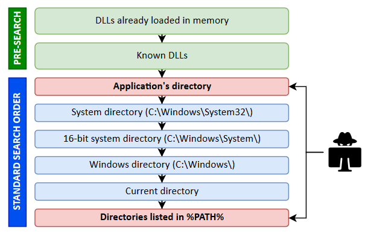
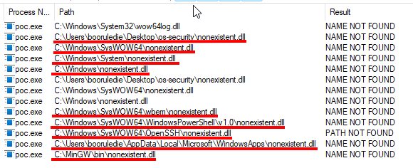
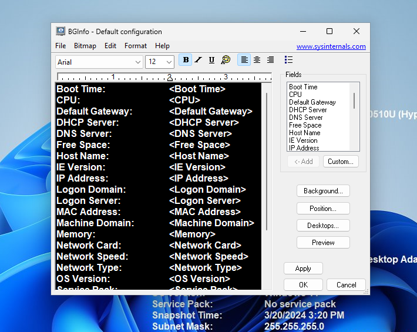
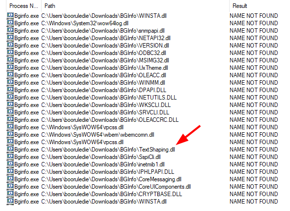

# What's DLLs ?

DLLs are like shared code libraries that computer programs use. They contain instructions for doing common tasks. Many programs can use the same DLL, saving space and making things run smoother.

# What's DLL Search Order Hijacking Attack ?

This vulnerability occurs when a program loads a DLL from an insecure location before legitimate locations. When a program tries to load a DLL, Windows checks for specific locations in order:



In order to see a live example we can compile `poc.c` file which is a file that tries to import a DLL named `nonexistent.dll`. This DLL is not existed in any directory so we can see which locations Windows searches to find the DLL.

Compile the C file:
```cmd
gcc -o poc.exe poc.c
```

Open Process Monitor and filter with following options:
1. `Process Name` `is` `poc.exe`
2. `Path` `endswith` `.dll`
3. `Result` `contains` `not found`

These filters help us find the locations where the `poc.exe` program searches for `unexisted.dll` in order to successfully import it.

Then execute the `poc.exe` program.
```cmd
poc.exe
```



If attacker is allowed to create a file in one of these specified paths, then the poc.exe would be vulnerable to Hijacking Attack.

# Simulation

First of all we need to create a dll that invokes the `calc.exe` which is calculator in Windows.
```cmd
gcc -shared -o test.dll dll.c
```

Now test it with following command, it should show up the calculator application:
```cmd
rundll32.exe test.dll, DllMain
```

This behaviour will be used for the **Proof Of Concept**.

Now let's install **BgInfo** app from Microsoft's offical website:
```http
https://learn.microsoft.com/en-us/sysinternals/downloads/bginfo
```

Unzip the program and run the application to see if it works, it should look like this:


Close the app and open Process Monitor, we'll filter the missing DLLs `bginfo.exe` tries to import but can't:


I've picked `TextShaping.dll`. Now let's move our `test.dll` into this folder and re-execute the `bginfo.exe`.
```
move test.dll <PASTE YOUR DLL LOCATION HERE>
```

After the execution it should pop up the calculator app. Here's a video of whole process:
<a href="http://www.youtube.com/watch?feature=player_embedded&v=K-3M5oPFdvw
" target="_blank"></a>

# How to Prevent

This attack worked because Downloads directory is not a safe directory to execute programs. Windows provides some default directories for that use called:
* Program Files 
* Program Files (x86)

If you look at the permission of these directories you can see that attackers are not allowed to create files without administrator privilege.

Another solution would be making proper permission adjustments for the directories you'll execute programs.

And lastly if you'll use a program that is developed by you or your organization, you can add your dll names to KnownDLLs registry. When you add your dlls in this registry they cannot be hijacked as Windows looks for these DLLs directly from C:/System32 which is a directory that attackers cannot create files without administrator permissions.
